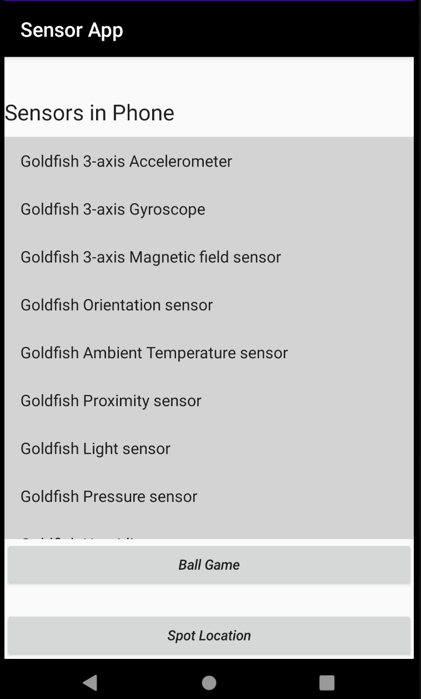
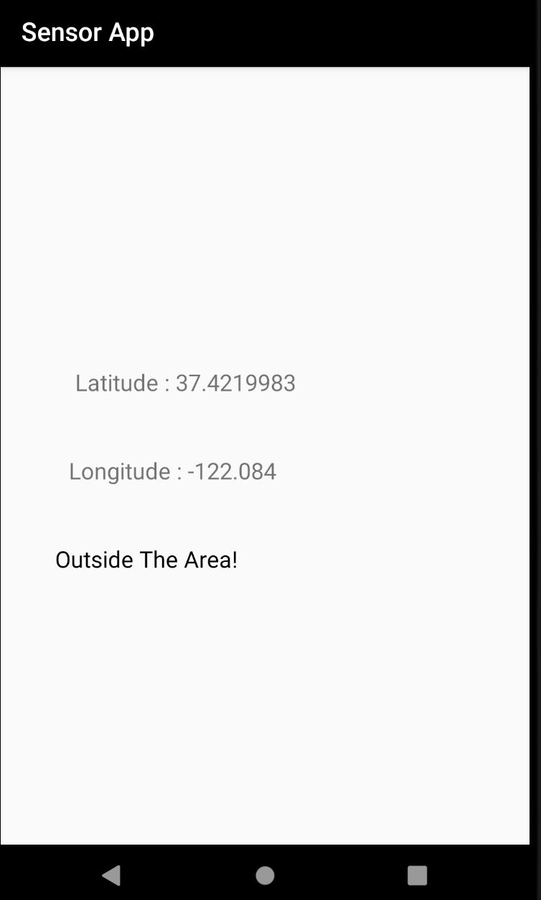

# Android Sensor Application with ball game and Location Detector 

Click the ball game to play the game and Spot location button to show if you left your programmed area(work	only	in	foreground).

For Developers, please not that Android Studio AVD uses Latitude and Longitude in USA

It is advised you use an android mobile device for testing. 
